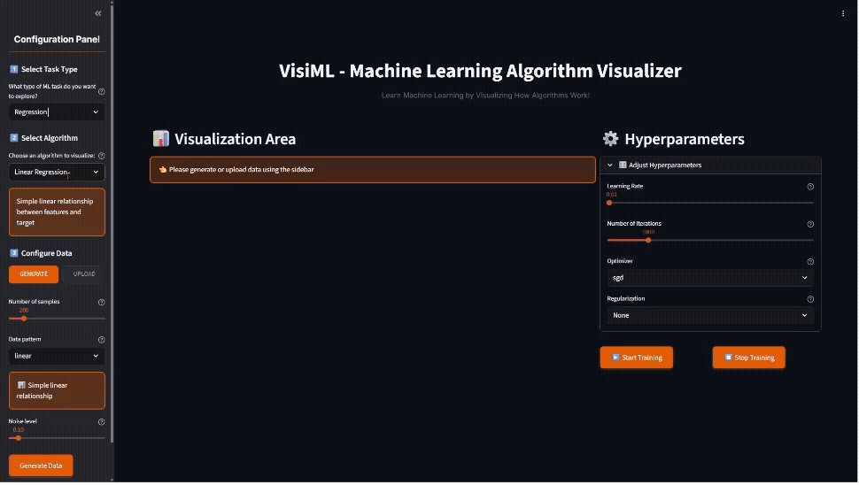

# 🧠 VisiML - Interactive Machine Learning Visualization Platform

<div align="center">

[](https://www.python.org/downloads/)
[](https://streamlit.io/)
[](LICENSE)
[](https://visi-ml.onrender.com/)

**Transform your understanding of Machine Learning through interactive, real-time visualizations!**

[🚀 **Live Demo**](https://visi-ml.onrender.com/) | [📚 **Documentation**](#-features) | [🎯 **Quick Start**](#-quick-start) | [🤝 **Contributing**](#-contributing)


*Watch algorithms learn in real-time with VisiML's interactive interface*

</div>

---

## 🌟 What is VisiML?

VisiML is a **cutting-edge educational platform** that transforms abstract machine learning concepts into **interactive, visual experiences**. Whether you're a student learning your first ML algorithm or a practitioner teaching complex concepts, VisiML makes machine learning accessible, engaging, and fun!

### 🎯 Why VisiML?

- 🔍 **See the "Black Box"** - Watch algorithms learn step-by-step
- 🎛️ **Interactive Learning** - Adjust parameters and see instant results  
- 📚 **Educational Focus** - Designed specifically for learning and teaching
- 🌐 **Accessible Anywhere** - No installation needed, runs in your browser
- 🎨 **Beautiful Visualizations** - Clear, intuitive graphics that enhance understanding

---

## ✨ Key Features

<table>
<tr>
<td width="50%">

### 🤖 **Machine Learning Algorithms**

**Regression:**
- **Linear Regression** - Multiple optimizers (SGD, Adam, RMSprop)
- **Polynomial Regression** - Non-linear pattern learning

**Classification:**
- **Logistic Regression** - Binary & multi-class support
- **Naive Bayes** - Probabilistic classification
- **Decision Tree** - Visual tree structures
- **Random Forest** - Ensemble visualization  
- **Support Vector Machine** - Margin visualization
- **K-Nearest Neighbors** - Distance-based classification

</td>
<td width="50%">

### 🎨 **Interactive Visualizations**

- **Real-time Training** - Watch models learn iteration by iteration
- **Decision Boundaries** - See how algorithms separate classes
- **Parameter Effects** - Adjust hyperparameters with instant feedback
- **Performance Metrics** - Loss curves, accuracy, confusion matrices
- **Data Patterns** - Multiple built-in datasets and generators
- **Learning Curves** - Track model improvement over time

</td>
</tr>
</table>



*Interactive regression with real-time decision boundary visualization*


*Interactive classification with real-time decision boundary visualization*

### 🎲 **Smart Data Generation**

Generate perfect datasets for learning different concepts:

**Regression Patterns:**
- `Linear` - Simple relationships
- `Polynomial` - Quadratic curves  
- `Sinusoidal` - Wave patterns
- `Exponential` - Growth curves
- `Logarithmic` - Decay patterns

**Classification Patterns:**
- `Blobs` - Separated clusters
- `Moons` - Interleaving crescents
- `Circles` - Concentric patterns
- `Spiral` - Complex non-linear
- `XOR` - Linearly non-separable


---

## 🚀 Quick Start

### 🌐 Online (Recommended)

**Try VisiML instantly - no installation required!**

👉 **[Launch VisiML](https://visi-ml.onrender.com/)** 👈

Perfect for:
- Quick demonstrations
- Classroom use
- Learning on any device
- Sharing with others

### 💻 Local Installation

Want to run VisiML locally or contribute to development?

```bash
# 1. Clone the repository
git clone https://github.com/tejasj228/Visi-ML.git
cd Visi-ML/visiml

# 2. Create virtual environment (recommended)
python -m venv venv
source venv/bin/activate  # On Windows: venv\Scripts\activate

# 3. Install dependencies
pip install -r requirements.txt

# 4. Launch VisiML
streamlit run app.py
```

🎉 **Open your browser to `http://localhost:8501` and start exploring!**

---

## 📖 How to Use VisiML

### 🎯 **Step-by-Step Guide**

<table>
<tr>
<td width="20%" align="center"><h3>1️⃣</h3></td>
<td><strong>Choose Task Type</strong><br/>Select between Regression (predicting numbers) or Classification (predicting categories)</td>
</tr>
<tr>
<td width="20%" align="center"><h3>2️⃣</h3></td>
<td><strong>Pick Algorithm</strong><br/>Choose from 8 different ML algorithms, each with detailed explanations</td>
</tr>
<tr>
<td width="20%" align="center"><h3>3️⃣</h3></td>
<td><strong>Generate or Upload Data</strong><br/>Use built-in patterns or upload your own CSV files</td>
</tr>
<tr>
<td width="20%" align="center"><h3>4️⃣</h3></td>
<td><strong>Adjust Parameters</strong><br/>Use intuitive sliders to modify algorithm hyperparameters</td>
</tr>
<tr>
<td width="20%" align="center"><h3>5️⃣</h3></td>
<td><strong>Train & Visualize</strong><br/>Watch the algorithm learn in real-time with beautiful visualizations</td>
</tr>
<tr>
<td width="20%" align="center"><h3>6️⃣</h3></td>
<td><strong>Analyze Results</strong><br/>Explore performance metrics, decision boundaries, and insights</td>
</tr>
</table>

### 🎨 **Example Walkthrough: Decision Tree**

```python
# What you'll see in VisiML:
1. Select "Classification" → "Decision Tree"
2. Generate "spiral" pattern data (500 samples)
3. Adjust max_depth slider (try 3, 5, 10)
4. Click "Train Model" 
5. Watch the decision boundary form in real-time
6. See how tree depth affects overfitting
```

**Perfect for understanding:** How decision trees split data and the effect of depth on model complexity!

---

## 🎓 Perfect for Education

### 👨‍🏫 **For Educators**

- **Live Demonstrations** - Show algorithms in action during lectures
- **Interactive Assignments** - Let students explore parameter effects
- **Concept Visualization** - Make abstract concepts concrete
- **Comparison Studies** - Side-by-side algorithm performance
- **No Setup Required** - Works instantly in any browser

### 👩‍🎓 **For Students**

- **Self-Paced Learning** - Explore at your own speed
- **Immediate Feedback** - See results instantly
- **Visual Understanding** - Grasp concepts through visualization
- **Hands-on Practice** - Learn by doing, not just reading
- **Build Intuition** - Develop "feel" for how algorithms work

### 🏢 **For Professionals**

- **Algorithm Selection** - Compare methods for your use case
- **Hyperparameter Insights** - Understand parameter effects
- **Team Training** - Educate colleagues interactively
- **Proof of Concepts** - Quickly test ideas
- **Client Demonstrations** - Show ML concepts to stakeholders

---

## �️ Technical Details

### 🏗️ **Architecture**

```
VisiML/
├── 🎨 app.py                    # Streamlit web application (main interface)
├── 🤖 ml_models.py             # ML algorithm implementations  
├── 🎲 data_generator.py        # Synthetic data generation
├── 📊 visualization_utils.py   # Plotting and visualization functions
├── 📋 requirements.txt         # Python dependencies
├── 🚀 render.yaml             # Deployment configuration
└── 📚 *.ipynb                 # Jupyter notebook examples
```

### 🔧 **Core Technologies**

- **Frontend:** Streamlit (Python web framework)
- **ML:** Custom implementations + scikit-learn integration
- **Visualization:** Matplotlib, Plotly, Seaborn
- **Data:** NumPy, Pandas
- **Deployment:** Render.com (free tier)

### ⚡ **Performance Features**

- **Optimized Rendering** - Efficient matplotlib integration
- **Real-time Updates** - Smooth parameter adjustments
- **Memory Management** - Handles large datasets efficiently
- **Cross-platform** - Works on Windows, Mac, Linux
- **Mobile Friendly** - Responsive design for tablets/phones

---

## 🌍 Deployment Options

VisiML is designed for easy deployment across multiple platforms:

### 🎯 **Option 1: Render (Current Live Site)**
- ✅ **Free tier available**
- ✅ **Auto-deployment from GitHub**  
- ✅ **Custom domain support**
- ✅ **SSL included**

### ☁️ **Option 2: Streamlit Community Cloud**
- ✅ **Free for public repos**
- ✅ **Perfect for educational use**
- ✅ **Direct GitHub integration**
- ✅ **Streamlit-optimized**

### 🐳 **Option 3: Docker + Any Cloud**
```dockerfile
# Coming soon: Docker support for
# AWS, Google Cloud, Azure, etc.
```

**See [DEPLOYMENT.md](DEPLOYMENT.md) for detailed deployment instructions.**

---

## 🤝 Contributing

We welcome contributions from the community! VisiML is open-source and thrives on collaboration.

### 🚀 **Quick Contributing Guide**

```bash
# 1. Fork the repository on GitHub
# 2. Clone your fork
git clone https://github.com/YOUR-USERNAME/Visi-ML.git

# 3. Create a feature branch
git checkout -b feature/amazing-new-feature

# 4. Make your changes
# 5. Test thoroughly
# 6. Commit with clear messages
git commit -m "Add amazing new feature that does X"

# 7. Push and create Pull Request
git push origin feature/amazing-new-feature
```

### 🎯 **Ways to Contribute**

- 🐛 **Bug Fixes** - Help us squash bugs
- ✨ **New Features** - Add algorithms, visualizations, or UI improvements
- 📚 **Documentation** - Improve guides, add examples
- 🧪 **Testing** - Add test cases, improve coverage
- 🎨 **Design** - Enhance UI/UX, create graphics
- 🌍 **Translations** - Make VisiML accessible globally

### 🏆 **Recognition**

All contributors are acknowledged in our [Contributors Gallery](https://github.com/tejasj228/Visi-ML/graphs/contributors)!

---

## 📄 License & Legal

**VisiML is open-source software licensed under the [MIT License](LICENSE).**

This means you can:
- ✅ Use VisiML for any purpose (personal, educational, commercial)
- ✅ Modify and distribute the code
- ✅ Create derivative works
- ✅ Use in proprietary software

**Attribution:** Please keep the original license notice when redistributing.

---

## 🙏 Acknowledgments

VisiML stands on the shoulders of giants:

- 🎨 **[Streamlit](https://streamlit.io/)** - For making beautiful web apps with Python
- 🧮 **[NumPy](https://numpy.org/) & [Pandas](https://pandas.pydata.org/)** - For efficient data handling
- 📊 **[Matplotlib](https://matplotlib.org/) & [Plotly](https://plotly.com/)** - For stunning visualizations  
- 🤖 **[scikit-learn](https://scikit-learn.org/)** - For ML algorithm inspiration
- 🎓 **Educational Community** - For feedback and feature requests
- 🌟 **Contributors** - For making VisiML better every day

**Special thanks to educators and students worldwide who make learning ML a joy!**

---

## 🚧 Roadmap & Future Features

### 🔄 **Coming Soon**

- [ ] 🧠 **Deep Learning Models** (Neural Networks, CNNs)
- [ ] 📊 **Clustering Algorithms** (K-Means, DBSCAN, Hierarchical)
- [ ] ⏰ **Time Series Analysis** (ARIMA, Prophet, LSTM)
- [ ] 🔄 **Model Comparison Dashboard** (Side-by-side analysis)
- [ ] 📱 **Mobile App** (Native iOS/Android)
- [ ] 🌍 **Multi-language Support** (Spanish, French, German, etc.)

### 💡 **Long-term Vision**

- 🎓 **Curriculum Integration** - Ready-made lesson plans
- 🏆 **Gamification** - Learning achievements and progress tracking
- 👥 **Collaborative Features** - Shared workspaces and assignments
- 🔌 **API Access** - Programmatic access for advanced users
- 📈 **Advanced Analytics** - Detailed learning insights

**Have ideas? [Open an issue](https://github.com/tejasj228/Visi-ML/issues) and let's discuss!**

---

<div align="center">

## 🌟 Star the Project!

**If VisiML helped you understand ML better, please give us a ⭐ on GitHub!**

[](https://github.com/tejasj228/Visi-ML)

**[🚀 Try VisiML Now](https://visi-ml.onrender.com/) | [📚 Read the Docs](#-features) | [🤝 Contribute](#-contributing)**

---

**Made with ❤️ for Machine Learning Education**

*Empowering the next generation of ML practitioners through interactive visualization*

</div>
